# Raport z testu penetracyjnego.
# Radosław Dębek, nr indeksu: 303689.
## 1. Skanowanie wirtualnych maszyn pod kątem otwartych portów za pomocą **nmap**.

1.1 Host metasploitable:

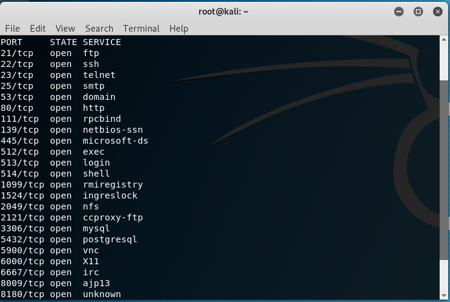

1.2 Host vulnix:

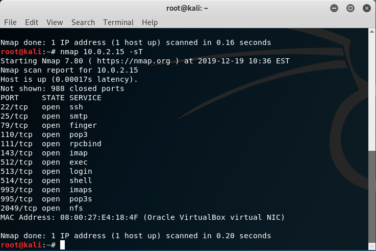

## 1.3. Skanowanie wirtualnych maszyn pod kątem systemu operacyjnego oraz wersji używanych usług.

1.4 Host metasploitable:

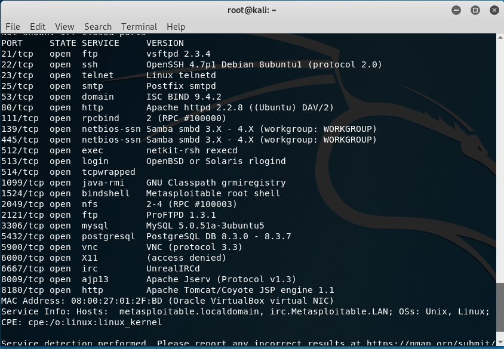

1.5 Host vulnix:

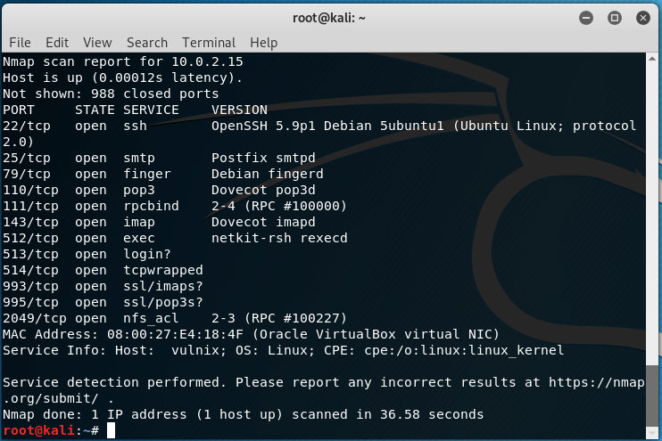

## 2. Skanowanie podatności przy pomocy Nessus oraz openVAS.

2.1 Host metasploitable:

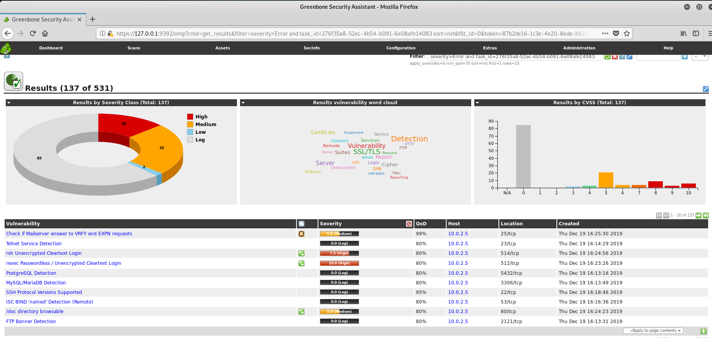

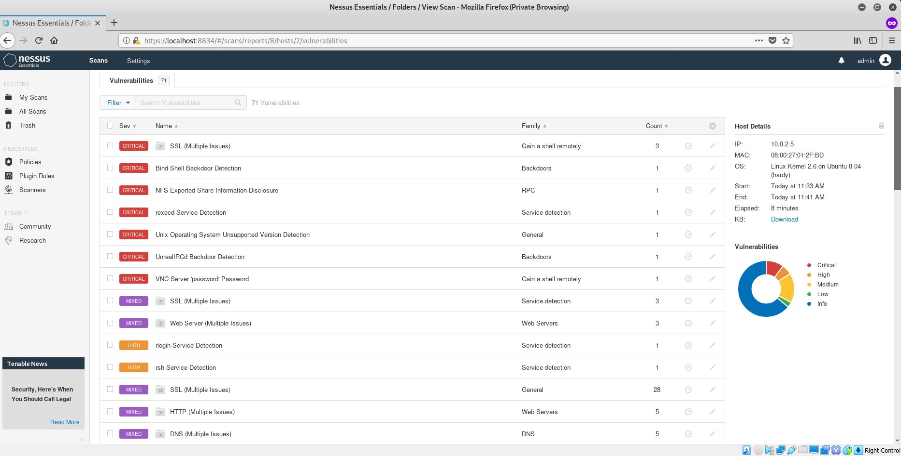

2.3 Host vulnix:

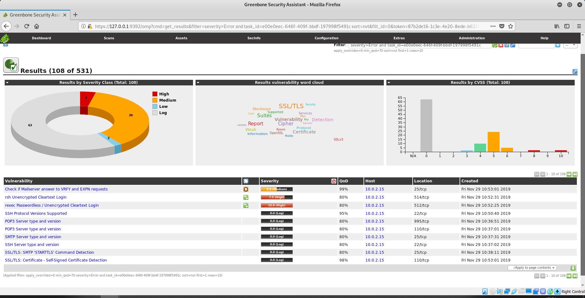

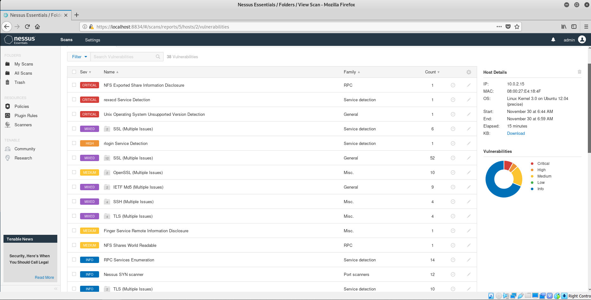

# 3. Narzędzie metasploit.

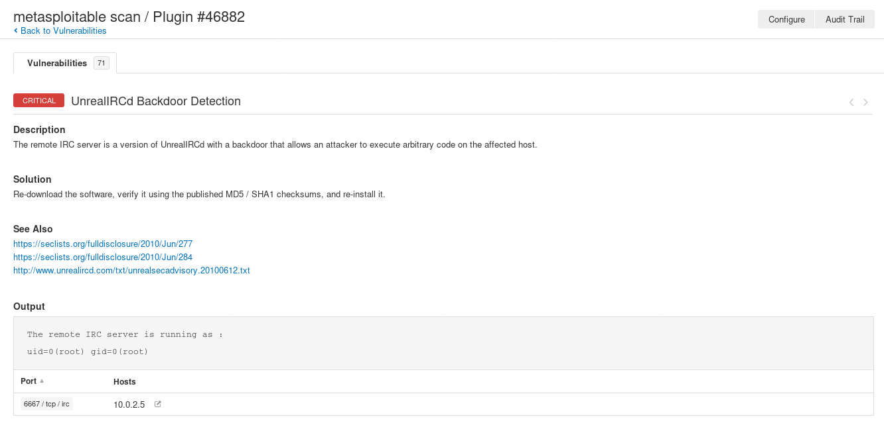

Jak widać na załączonym obrazku host metasploitable ma podatność UnrealIRCd backdoor. Szukam zatem exploitów ją wykorzystujących przy pomocy metasploit:

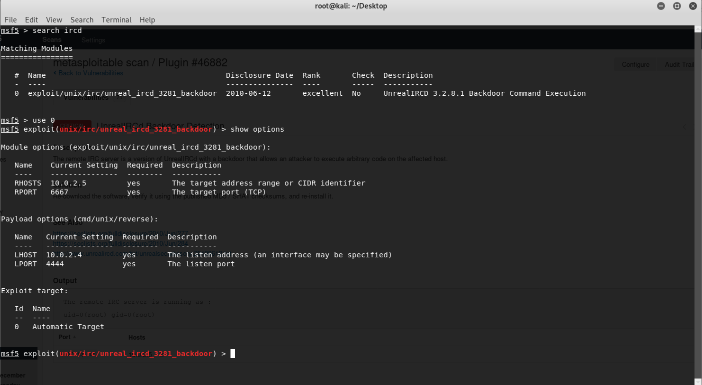

Po ustawieniu odpowiednich parametrów i wykonaniu exploita otrzymuję następujący wynik:

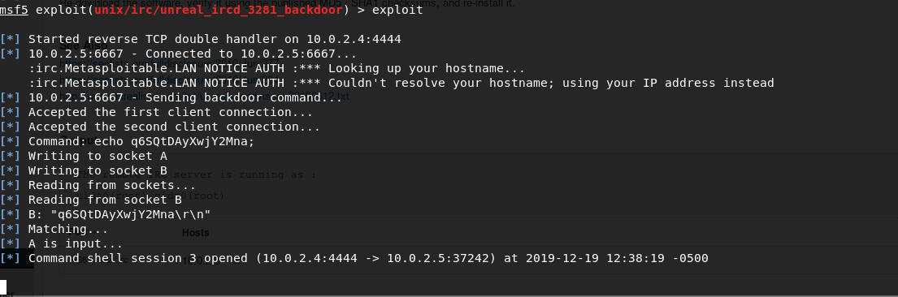

Co pozwala mi na wykonanie dowolnych komend.  
Zdalne wyłączenie maszyny wirtualnej vulnix:

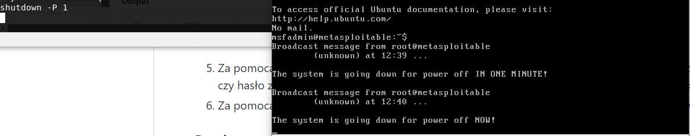

## 3.1 Lista użytkowników SMTP na maszynie vulnix.

Szukam exploitów pozwalających odnalezienie nazw użytkowników SMTP:

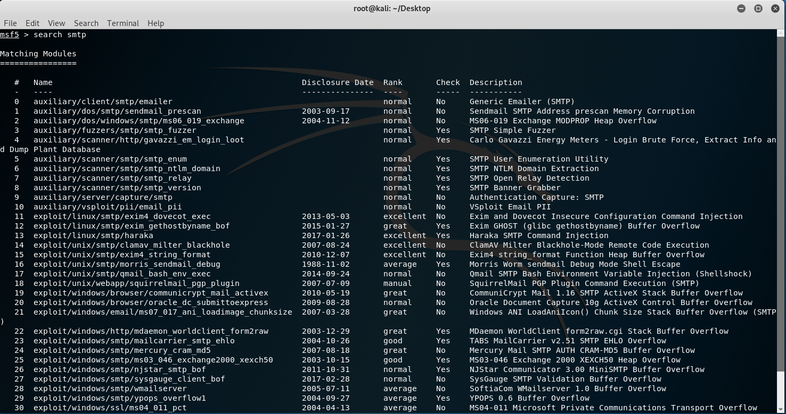

Przy pomocy *smtp_enum* otrzymuję listę użytkowników:

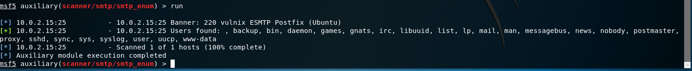

## 3.2 Znajdowanie hasła do użytkownika *user*:

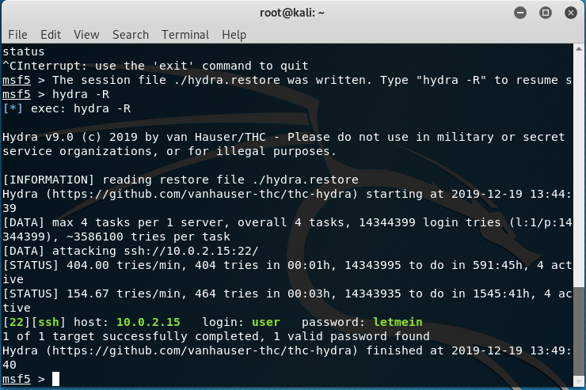

