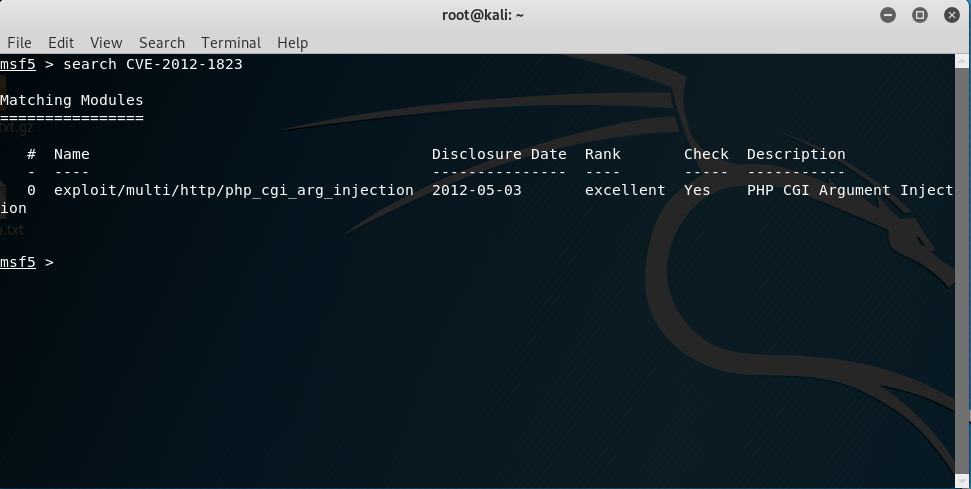
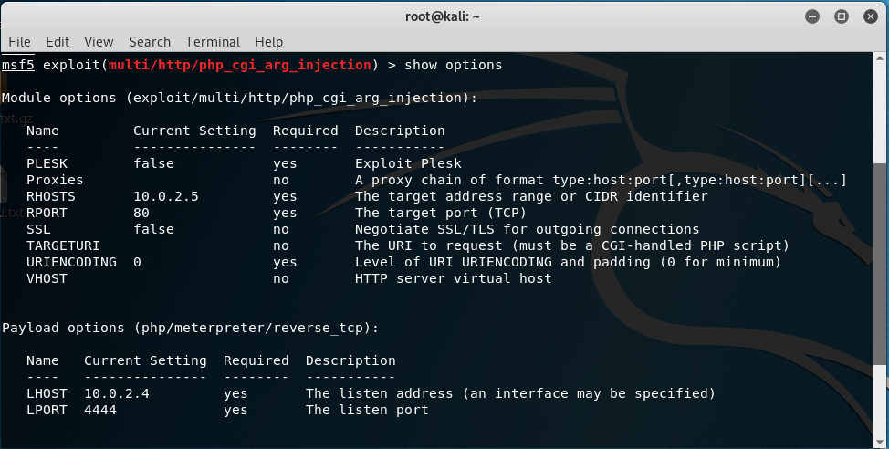
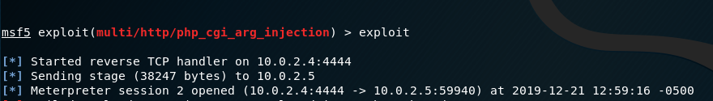

# Raport z testu penetracyjnego.
# Radosław Dębek, nr indeksu: 303689.
## 1. Skanowanie wirtualnych maszyn pod kątem otwartych portów za pomocą **nmap**.

1.1 Host metasploitable:

1.2 Host vulnix:

## 1.3. Skanowanie wirtualnych maszyn pod kątem systemu operacyjnego oraz wersji używanych usług.

1.4 Host metasploitable:

1.5 Host vulnix:

## 2. Skanowanie podatności przy pomocy Nessus oraz openVAS.

2.1 Host metasploitable:

2.3 Host vulnix:

# 3. Narzędzie metasploit.

Wyszukuję podatność:

Po ustawieniu odpowiednich parametrów i wykonaniu exploita otrzymuję następujący wynik:

Co pozwala mi na wykonanie dowolnych komend.

## 3.1 Lista użytkowników SMTP na maszynie vulnix.

Szukam exploitów odnajdujących nazwy użytkowników SMTP:

Przy pomocy *smtp_enum* otrzymuję listę użytkowników:

## 3.2 Znajdowanie hasła do użytkownika *user* przy pomocy ataku słownikowego:

