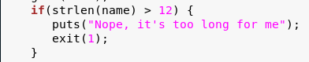
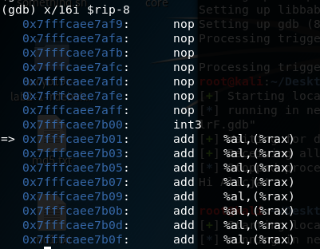
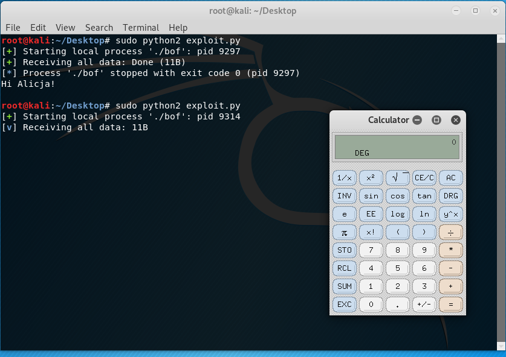

**Zadanie 1.** 

Ćwiczenie 1. Kompilator ostrzega przed używaniem gets().

.PNG)

Ćwiczenie 2. Błąd w programie polega na zastosowaniu wadliwej i podatnej na przepełnienie bufora instrukcji gets().

Ćwiczenie 3. Program zamyka się poprawnie dzięki zastosowaniu instrukcji if, która chroni przed wpisywaniem ciągu znaków o długości większej niż 12.

Ćwiczenie 4. Wartości RBP i RIP są takie same, dzieję się tak, ponieważ bufor na stosie został przepełniony i nadpisał wartości tych rejestrów.

.PNG)
.PNG)

Ćwiczenie 5. Program zakończył działanie, gdyż nastąpiła eksploitacja wadliwego kodu i przepełniono bufor.

Ćwiczenie 6. Program zatrzymał się pod adresem 0x7ffc54c0d750.

Ćwiczenie 7. W sąsiedztwie miejsca zatrzymania programu znajdują się instrukcje add.

Ćwiczenie 8. Po wznowieniu działania program crashuje się z powodu przepełnenia bufora.

Ćwiczenie 9. 

Ćwiczenie 10. Program zakończył się poprawnie, ponieważ funkcja systemowa exec podmienia aktualnie wykonywany proces na nowy, w tym przypadku na kalkulator, który można zamknąć bez żadnego problemu.
