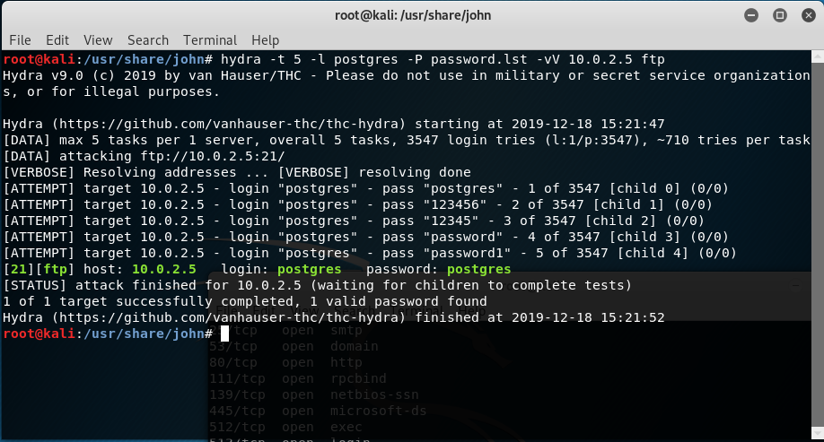
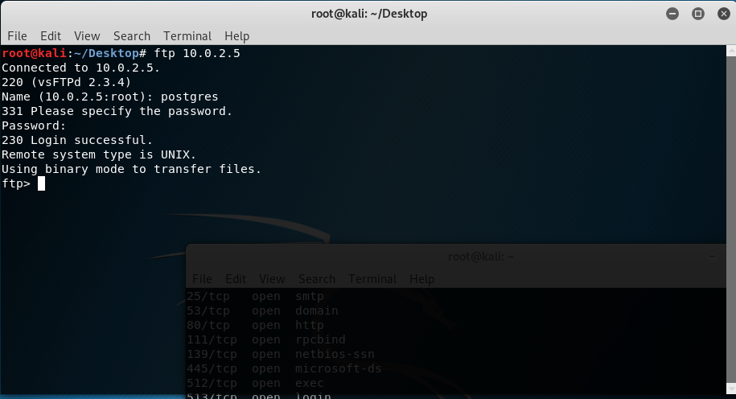
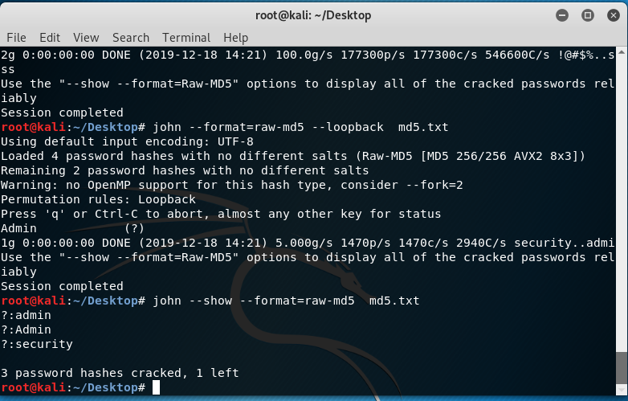

# Łamanie haseł.
# Radosław Dębek, nr indeksu: 303689.
## 1. Próba odnalezienia hasła do usługi ftp użytkownika postgres na maszynie metasploitable. (Używając narzędzia Hydra)

Sprawdzenie poprawności:

## 2. Hasła uzyskane przy pomocy narzędzia John The Ripper:

