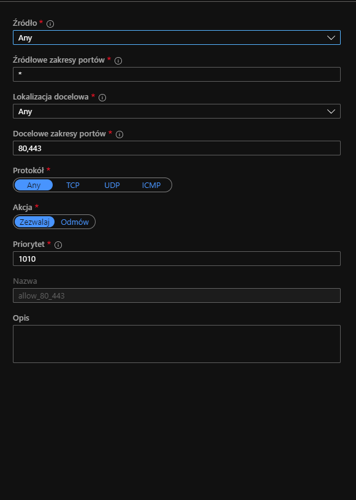
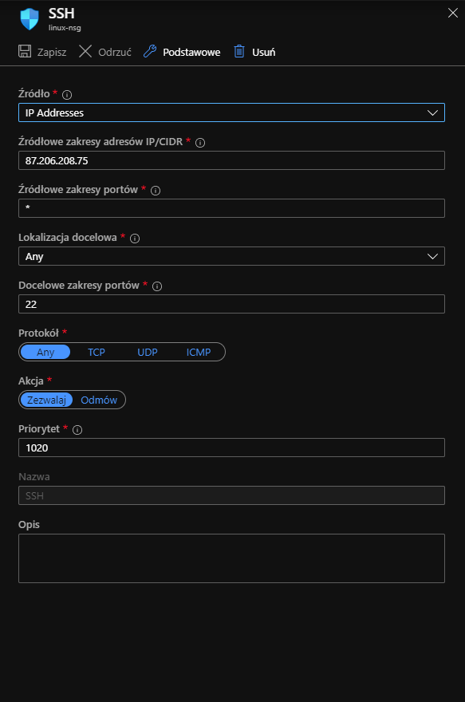
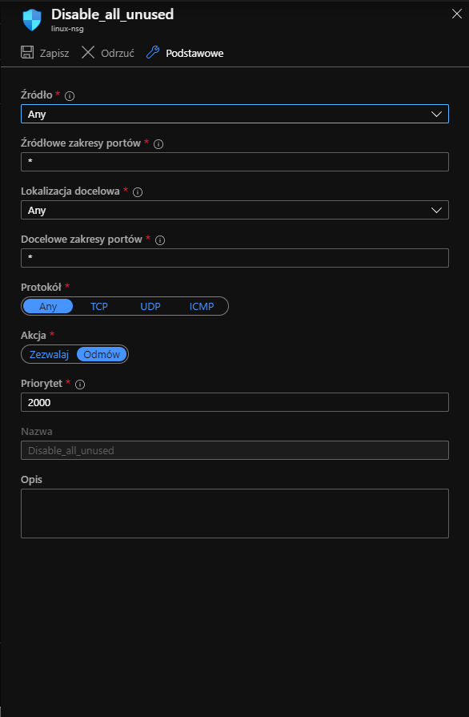
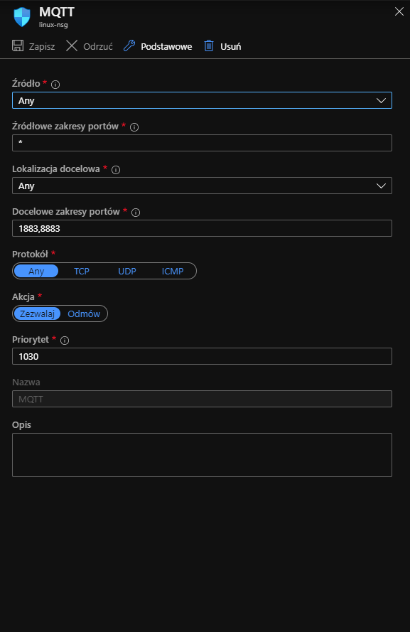

# Zadanie 2 - konfiguracja reguł firewalla.
1. Dopuszczenie ruchu na porcie 80 i 443 z dowolnej maszyny:

2. Zezwolenie na połączenie SSH dla wybranego adresu IP:

n

3. Blokada wszystkich nieużywanych portów:

4. Dopuszczenie ruchu dla protokołu MQTT:

## Best practices hardeningu serwera linux:
- **Częsta aktualizacja systemu operacyjnego i używanego oprogramowania.**
- **Używanie silnych haseł dostępu.**
- Wyłączenie nieużywanych usług.
- Monitorowanie logów systemowych.
- Szyfrowanie dysków.

Pierwsze dwa z nich są moim zdaniem najważniejszym działaniem prowadzącym do hardeningu systemu operacyjnego i są zupełną podstawą bezpiecznego i świadomego używania oprogramowania.

SSH certificates logins:

